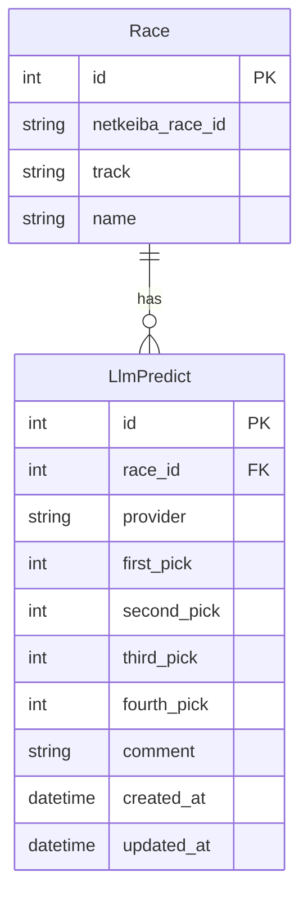
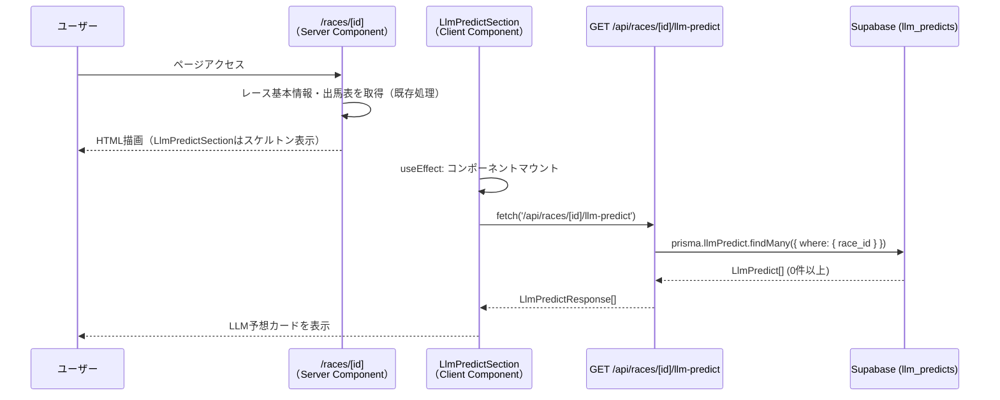
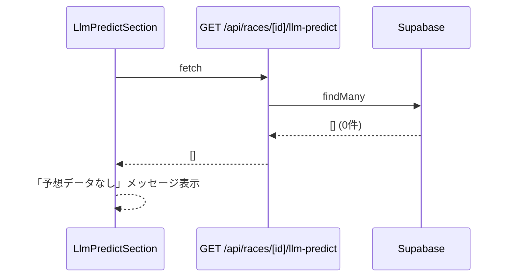

# 機能設計書 (Functional Design Document)

> 対象機能: LLM予想表示機能
> 関連PRD: [docs/product-requirements.md](./product-requirements.md)

---

## システム構成図

```mermaid
graph TB
    User[ユーザー（ブラウザ）]
    Owner[オーナー（LLMパイプライン）]

    subgraph Horecast
        RacePage["/races/[id] ページ"]
        LlmSection["LlmPredictSection<br/>（Clientコンポーネント）"]
        API["GET /api/races/[id]/llm-predict"]
        Prisma[Prisma ORM]
    end

    subgraph Supabase
        DB[(PostgreSQL<br/>llm_predicts テーブル)]
    end

    Owner -->|LLM予想結果を INSERT| DB
    User -->|ページ表示| RacePage
    RacePage -->|マウント後 fetch| LlmSection
    LlmSection -->|fetch| API
    API -->|findMany| Prisma
    Prisma -->|SELECT| DB
    DB -->|予想データ| Prisma
    Prisma -->|LlmPredict[]| API
    API -->|JSON レスポンス| LlmSection
    LlmSection -->|UI描画| User
```

---

## 技術スタック

| 分類 | 技術 | 選定理由 |
|------|------|----------|
| フレームワーク | Next.js 15 (App Router) | 既存プロジェクトのスタック |
| ORM | Prisma 6 | 既存プロジェクトのスタック |
| DB | PostgreSQL (Supabase) | 既存プロジェクトのスタック |
| UI | Tailwind CSS + shadcn/ui | 既存プロジェクトのスタック |
| 言語 | TypeScript 5 | 既存プロジェクトのスタック |

---

## データモデル定義

### エンティティ: LlmPredict

```typescript
interface LlmPredict {
  id:           number;          // 自動採番 (PK)
  race_id:      number;          // Race.id への外部キー
  provider:     string;          // LLMプロバイダー識別子 ("openai" | "claude" | ...)
  first_pick:   number;          // ◎ 推奨馬番 (1-18)
  second_pick:  number;          // ○ 推奨馬番 (1-18)
  third_pick:   number;          // ▲ 推奨馬番 (1-18)
  fourth_pick:  number;          // △ 推奨馬番 (1-18)
  comment:      string | null;   // 予想コメント（最大500文字）
  created_at:   Date;
  updated_at:   Date;
}
```

**制約**:
- `[race_id, provider]` でユニーク制約（1レースにつき1プロバイダー1行）
- 新しいLLMプロバイダーはテーブル変更なく `provider` に新しい文字列で追加可能
- `first_pick / second_pick / third_pick / fourth_pick` は同じ馬番を重複して持たない（アプリ側バリデーション）

### Prismaスキーマ（追加分）

```prisma
model LlmPredict {
  id           Int      @id @default(autoincrement())
  race_id      Int
  provider     String   // "openai", "claude", etc.
  first_pick   Int      // ◎ 推奨馬番
  second_pick  Int      // ○ 推奨馬番
  third_pick   Int      // ▲ 推奨馬番
  fourth_pick  Int      // △ 推奨馬番
  comment      String?  // 予想コメント

  created_at   DateTime @default(now())
  updated_at   DateTime @default(now()) @updatedAt

  race         Race     @relation(fields: [race_id], references: [id])

  @@unique([race_id, provider])
  @@index([race_id])
}
```

### ER図（追加分）



---

## コンポーネント設計

### 1. APIルート: `/api/races/[id]/llm-predict`

**ファイルパス**: `src/app/api/races/[id]/llm-predict/route.ts`

**責務**:
- レースIDに紐づくLLM予想をDBから全件取得して返す
- データなしの場合は空配列を返す（エラーにしない）
- キャッシュなし（`cache: 'no-store'`）

**インターフェース**:
```typescript
// GET /api/races/[id]/llm-predict
// Response: LlmPredictResponse[]
interface LlmPredictResponse {
  provider:    string;
  first_pick:  number;
  second_pick: number;
  third_pick:  number;
  fourth_pick: number;         // △ 推奨馬番
  comment:     string | null;
}
```

**依存関係**: Prisma Client, Race モデル, LlmPredict モデル

---

### 2. UIコンポーネント: `LlmPredictSection`

**ファイルパス**: `src/app/components/LlmPredictSection.tsx`

**責務**:
- レースIDを受け取り `/api/races/[id]/llm-predict` をクライアントサイドで非同期取得
- ローディング中はスケルトンUIを表示
- 各LLMプロバイダーのカードを横並びで表示
- 推奨馬番を◎○▲△マーク付きで表示
- 予想コメントを表示

**インターフェース**:
```typescript
interface LlmPredictSectionProps {
  raceId: number;
}

export function LlmPredictSection({ raceId }: LlmPredictSectionProps): JSX.Element
```

**依存関係**: `LlmPredictResponse` 型, shadcn/ui Card, Badge

---

### 3. レース詳細ページへの組み込み

**ファイルパス**: `src/app/races/[id]/page.tsx`（既存ファイルへの追加）

**変更内容**:
- `<EntryTable />` の直下に `<LlmPredictSection raceId={race.id} />` を追加
- 既存のサーバーコンポーネントの構造を変更しない（LlmPredictSection自体がクライアントコンポーネント）

---

## ユースケース図

### UC-1: レース詳細ページでLLM予想を表示する



### UC-2: LLM予想データが存在しない場合



---

## 画面遷移・UI設計

### レース詳細ページのレイアウト（追加後）

```text
/races/[id]
├── レースヘッダー（レース名、距離、コース種別）
├── 出馬表 (EntryTable) ← 既存
├── ━━━━━━━━━━━━━━━━━━━━━━
│   LLM予想セクション (LlmPredictSection) ← NEW
│   ┌──────────────┐  ┌──────────────┐
│   │  🤖 OpenAI   │  │  🤖 Claude   │
│   │ ◎ 3番        │  │ ◎ 5番        │
│   │ ○ 7番        │  │ ○ 2番        │
│   │ ▲ 1番        │  │ ▲ 8番        │
│   │ △ 4番        │  │ △ 11番       │
│   │ [コメント...]  │  │ [コメント...]  │
│   └──────────────┘  └──────────────┘
├── 推奨馬券 (RecommendedBets) ← 既存
├── 着順結果 (RaceResultTable) ← 既存
└── 配当 (PayoutTable) ← 既存
```

### LlmPredictSection UIの詳細

**ローディング状態（スケルトン）**:
```text
┌─────────────────────────────────────┐
│ LLM予想                              │
│ ┌────────────┐  ┌────────────┐      │
│ │ ░░░░░░░░   │  │ ░░░░░░░░   │      │
│ │ ░░ ░░░     │  │ ░░ ░░░     │      │
│ │ ░░ ░░░     │  │ ░░ ░░░     │      │
│ └────────────┘  └────────────┘      │
└─────────────────────────────────────┘
```

**表示状態**:
```text
┌─────────────────────────────────────┐
│ LLM予想                              │
│ ┌────────────┐  ┌────────────┐      │
│ │ OpenAI     │  │ Claude     │      │
│ │ ◎ 3番 シリウス│  │ ◎ 5番 〇〇  │     │
│ │ ○ 7番 〇〇  │  │ ○ 2番 〇〇  │     │
│ │ ▲ 1番 〇〇  │  │ ▲ 8番 〇〇  │     │
│ │ △ 4番 〇〇  │  │ △ 11番 〇〇 │     │
│ │ 前走好走の...│  │ 馬場適正...  │     │
│ └────────────┘  └────────────┘      │
└─────────────────────────────────────┘
```

**データなし状態**:
```text
┌─────────────────────────────────────┐
│ LLM予想                              │
│ このレースのLLM予想はまだありません       │
└─────────────────────────────────────┘
```

### カラーコーディング（既存システムと統一）

| マーク | 意味 | 色 | 表示条件 |
|--------|------|----|---------|
| ◎ | 本命（first_pick） | red-600 | 常時 |
| ○ | 対抗（second_pick） | blue-600 | 常時 |
| ▲ | 単穴（third_pick） | green-600 | 常時 |
| △ | 連下（fourth_pick） | purple-600 | 常時 |

プロバイダーラベル: `badge` コンポーネントを使用（gray系）

---

## API設計

### GET /api/races/[id]/llm-predict

```http
GET /api/races/123/llm-predict
```

**レスポンス（正常・データあり）**:
```json
[
  {
    "provider": "openai",
    "first_pick": 3,
    "second_pick": 7,
    "third_pick": 1,
    "fourth_pick": 4,
    "comment": "前走で上がり3Fトップを記録した3番が有力。..."
  },
  {
    "provider": "claude",
    "first_pick": 5,
    "second_pick": 2,
    "third_pick": 8,
    "fourth_pick": 11,
    "comment": "このコースと距離で実績のある5番を本命に。..."
  }
]
```

**レスポンス（正常・データなし）**:
```json
[]
```

**エラーレスポンス**:
- `500 Internal Server Error`: DB接続エラー

---

## エラーハンドリング

| エラー種別 | 処理 | ユーザーへの表示 |
|-----------|------|-----------------|
| APIレスポンス 500 | fetchをcatchしてstateをエラーに | 「予想データの取得に失敗しました」 |
| データ0件 | 空配列を正常として処理 | 「このレースのLLM予想はまだありません」 |
| ネットワークエラー | catchしてstateをエラーに | 「予想データの取得に失敗しました」 |
| DB接続エラー | 500を返す | （上のAPIエラーとして処理） |

**重要**: いずれのエラーもページ全体をクラッシュさせない。LlmPredictSection内でエラーを吸収する。

---

## パフォーマンス最適化

- **非同期取得**: LlmPredictSectionはクライアントコンポーネントとしてuseEffect内でfetchし、ページ初期表示をブロックしない
- **スケルトンUI**: データ取得中はスケルトンを表示してCLS（累積レイアウトシフト）を防ぐ
- **インデックス**: `race_id` カラムにDBインデックスを設定し、クエリを高速化
- **ユニーク制約**: `[race_id, provider]` のユニーク制約で重複データを防ぐ

---

## テスト戦略

### ユニットテスト
- `GET /api/races/[id]/llm-predict`: データあり・データなし・DBエラーの各ケース

### 統合テスト
- レース詳細ページでLlmPredictSectionが正しくレンダリングされる
- LLM予想データが存在しない場合の表示

### 手動テスト
- Supabaseに直接テストデータを INSERT して表示確認
- モバイル・PC両端末での表示確認
